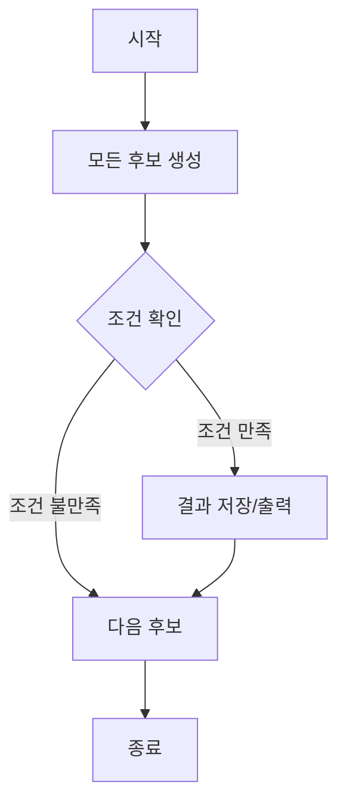

# # 브루트포스 알고리즘

## 📅 Study log

**Created:** 2026.02.05

**Last Updated:** 2026.02.05

---

## 🗝️ Key Concept

- **핵심 요약**: 가능한 모든 경우의 수를 모두 탐색하여 문제를 해결하는 완전 탐색 알고리즘.
    
- **관련 키워드**: #알고리즘 #브루트포스_알고리즘 #bruteforcing #완전탐색 #경우의수 #완전탐색 #전수조사 #순열 #조합 #재귀 #백트래킹
    
- **사용되는 상황**:
    1. 경우의 수가 적어 전수 탐색을 해도 적은 시간 내에 완료 할 수 있을 때.
    2. 복잡한 알고리즘을 생각하기 전, 정답 기준을 세울 수 있음.

---

## 📓 Theory

### 정의

- 문제 해결을 위해 후보가 될 수 있는 모든 해를 체계적으로 나열하고 시도해 문제를 해결하는 방법.
- 일반적으로 그리디 알고리즘이나 DP를 적용하기 어려울 때 사용.

### 성질

1. **정확성**: 이론적으로 가능한 모든 경우를 확인하므로 항상 정확한 답을 보장.
    
2. **단순성**: 설계와 구현이 매우 쉬움. 단순 반복문, 재귀, 순열 라이브러리 등을 활용해 쉽게 구현할 수 있음. 수학적 증명이 필요 없는 경우가 대부분.
    
3. **비효율성**: 데이터의 양이 조금만 많아져도 연산 횟수가 기하급수적으로 늘어남.
### 증명

브루트포스는 특정 수학적 귀납법보다는 전수조사의 논리에 기반.

조합론적 관점에서 어떤 집합 𝑆가 문제의 모든 가능한 해를 포함하고 있다면, 𝑠 ∈ 𝑆인 모든 요소에 대해 조건 𝑃(𝑠)를 검사했을 때, 𝑃(𝑠)가 참인 𝑠를 찾는 과정은 논리적으로 완벽.

즉 모든 경우를 시도하므로 가능한 해를 놓칠 확률 0.

### 시각 자료




---

## ⌛ Complexity

- 시간 복잡도: 일반적으로 $O(N)$, $O(N^2)$, 혹은 지수 시간인 $O(2^N)$, $O(N!)$까지 치솟음.
    
- 공간 복잡도: 보통 $O(1)$ (단순 루프 시) 혹은 $O(N)$.
    
- 추가 메모: 시간 제한이 **1초**라면 $N=10 \sim 12$일 때 $O(N!)$, $N=20 \sim 25$일 때 $O(2^N)$, $N=10^4 \sim 10^5$일 때 $O(N^2)$가 마지노선.
    

---

## ⚠️ Caution

1. **입력 크기 확인**: N의 범위를 보고 시간 초과가 나지 않는지 확인. N이 크다면 DP, 그리디, 이분 탐색 등으로 갈아타야 함.
    
2. **중복 탐색 주의**: 같은 경우를 여러 번 계산하지 않도록 방문 처리를 잘해야 함.
    

---

## ⚙️ Pseudocode

Plaintext

```
함수 브루트포스_탐색(문제 P):
    # 1. 문제에서 발생할 수 있는 '모든 후보'를 하나씩 꺼냄.
    각각의 후보 c를 P의 모든_가능한_선택지들 중에서 반복:
        
        # 2. 지금 꺼낸 후보 c가 정답의 조건에 맞는지 검사.
        만약 조건_확인(c, P)이 참이라면:
            반환 c  # 2-1. 정답을 찾았으므로 즉시 종료 및 결과 전달.
            
    # 3. 모든 후보를 다 확인했는데도 조건을 만족하는 게 없다면,
    반환 실패  # 해가 존재하지 않음
```

---

## 💻 Code snippets

Python

```
# Python: 1부터 N까지 모든 경우를 다 확인하는 형태
def find_answer(n, target):
    for i in range(1, n + 1):
        # 조건에 맞는지 확인
        if i == target:
            return i # 정답 발견
    return -1 # 정답 없음
```

C++

```
// C++: 다중 루프를 통한 조합 탐색
for (int i = 0; i < n; i++) {
    for (int j = i + 1; j < n; j++) {
        for (int k = j + 1; k < n; k++) {
            // 모든 3가지 조합을 다 확인
            int sum = card[i] + card[j] + card[k];
            if (sum <= target) result = max(result, sum);
        }
    }
}
```

---

## ☑️ Baekjoon Problems

- **[1000](1000.cpp)**
    
    - 핵심 아이디어:
        
    - 해법 요약:
        
- **1001**
    

---

## 📝 Memo

> Written by **OjOj717**