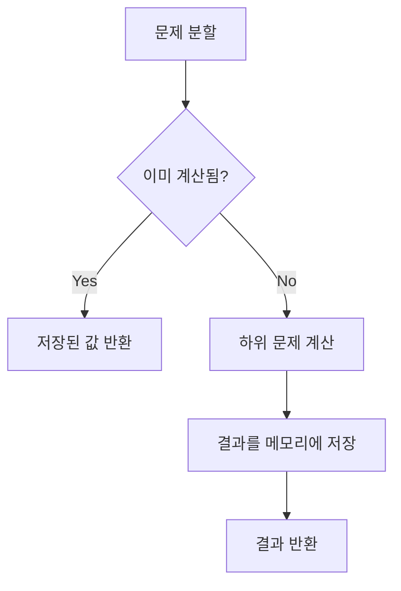

# # 다이나믹 프로그래밍

## 📅 Study Log

**Created:** 2026.02.06

**Last Updated:** 2026.02.09

---

## 🗝️ Key Concept

- **핵심 요약**: 한 번 계산한 하위 문제의 정답을 메모리에 저장하여 중복 계산을 방지해 속도를 비약적으로 높이는 방법.
    
- **관련 키워드**: #알고리즘 #dp #다이나믹_프로그래밍 #최적화 #메모이제이션 #점화식 #Top-Down #Bottom-Up #Tabulation
    
- **사용되는 상황**:
    1. 큰 문제를 작은 문제로 나눌 수 있고, 그 작은 문제의 답이 큰 문제의 해결책이 될 때.
    2. 동일한 작은 문제들이 반복적으로 등장할 때.

---

## 📓 Theory

### 정의

- 복잡한 문제를 풀기 위해 문제를 여러 개의 하위 문제로 나누어 해결한 뒤, 그 결과를 리스트나 배열 등에 저장했다가 나중에 동일한 하위 문제가 나왔을 때 꺼내쓰는 알고리즘 설계 기법. 동적 계획법이라고도 불림.
- "한 번 계산한 것은 두 번 하지 않는다."

### 성질

1. **최적 부분 구조**: 큰 문제의 최적해를 작은 문제의 최적해로 부터 구할 수 있는 구조.
    
2. **중복되는 부분 문제**: 동일한 작은 문제들을 반복적으로 계산.
    
3. **최적해 보장**: 모든 가능성을 조사하여 최적해 보장.
	
4. **효율성**: 지수 시간 복잡도를 갖는 재귀 문제를 다항 시간으로 대폭 단축.
	
### 구현 방식

- **Top-Down**: 재귀와 메모이제이션을 사용. 위에서 아래로 내려가며 필요한 순간에 계산.
- **Bottom-Up**: 반복문과 타뷸레이션을 사용. 작은 문제부터 차례대로 표를 채워나감.

### 시각 자료



---

## ⌛ Complexity

- 시간 복잡도: $O(\text{상태의 수} \times \text{한 상태를 처리하는 시간})$ 일반적으로 지수 시간 복잡도를 선형 또는 다항 시간으로 단축.
    
- 공간 복잡도: $O(\text{상태의 수})$ 결과값을 저장할 리스트나 배열 크기.
    
- 추가 메모: 공간 복잡도를 줄이기 위해 ‘Sliding Window' 기법을 사용해 직전 상태만 저장하기도 함.
    

---

## ⚠️ Caution

1. **메모리 제한**: 상태의 수가 너무 많으면 메모리 초과(MLE)가 발생할 수 있으므로, 배열의 크기를 신중히 선택해야함.

2. **점화식 도출**: 현재 상태를 이전 상태들로 어떻게 표현할지 결정하는 것이 핵심이자 가장 어려운 단계.
	
3. **초기값 설정**: dp[0], dp[1]등 가장 작은 단위의 문제에 대한 정답을 정확히 기입해야함.

---

## ⚙️ Pseudocode

Plaintext

```
함수 DP_하향식(현재_단계):
    # 1. 이미 해결한 적이 있는지 확인. (메모이제이션)
    만약 저장소[현재_단계]에 이미 계산된 결과가 있다면:
        저장된 값을 그대로 반환. (중복 계산 방지)

    # 2. 가장 작은 문제(기저 상태)인지 확인.
    만약 현재_단계가 더 이상 쪼갤 수 없는 기초 단계라면:
        정해진 결과값을 반환. (예: 피보나치 0번째는 0)

    # 3. 아직 계산하지 않았다면, 작은 문제들을 먼저 해결함.
    결과 = 점화식_계산( DP_하향식(이전_단계_1), DP_하향식(이전_단계_2) ... )

    # 4. 방금 계산한 따끈따끈한 결과를 저장소에 기록.
    저장소[현재_단계] = 결과

    반환 결과
```

```
함수 DP_상향식(목표_단계):
    # 1. 계산 결과를 차곡차곡 쌓아둘 빈 표(Table)를 준비.
    DP_테이블 = [0]으로 초기화된 리스트 (크기: 목표_단계 + 1)

    # 2. 우리가 이미 알고 있는 가장 기초적인 답들을 미리 적어둠. (초기값 설정)
    DP_테이블[0] = 기초값_0
    DP_테이블[1] = 기초값_1

    # 3. 2단계부터 목표 단계까지, 앞에서 구한 답들을 재료 삼아 다음 답을 구함.
    반복문 i를 2부터 목표_단계까지 진행:
        # 이전에 기록해둔 작은 문제들의 답(DP_테이블[i-1], [i-2] 등)을 활용함
        현재_단계의_답 = 점화식_계산( DP_테이블[i-1], DP_테이블[i-2] ... )
        
        # 구한 답을 표의 i번째 칸에 기록함.
        DP_테이블[i] = 현재_단계의_답

    # 4. 표의 마지막 칸에 도달하면 그것이 우리가 찾던 최종 정답
    반환 DP_테이블[목표_단계]
```
---

## 💻 Code snippets

Python

```
# 메모이제이션을 활용한 피보나치
memo = {}

def fibo(n):
    if n <= 1: return n
    if n in memo: return memo[n]
    
    memo[n] = fibo(n-1) + fibo(n-2)
    return memo[n]
```

C++

```
// 타뷸레이션을 활용한 피보나치
int dp[101];

int solve(int n) {
    dp[0] = 0;
    dp[1] = 1;
    for (int i = 2; i <= n; i++) {
        dp[i] = dp[i-1] + dp[i-2];
    }
    return dp[n];
}
```

---

## ☑️ Baekjoon Problems

- **[1463](1463.cpp)**
    
    - 제목: 1로 만들기
        
    - 활용: Bottom-up $$\text{arr}[i] = \min(\text{arr}[i-1], \text{arr}[i/2] \text{ (if } i\%2==0), \text{arr}[i/3] \text{ (if } i\%3==0)) + 1$$
    

---

## 📝 Memo


> Written by **OjOj717**