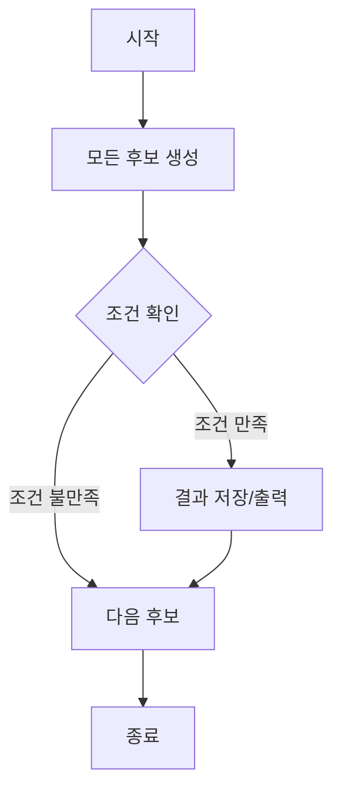

# # 다이나믹 프로그래밍

## 📅 Study Log

**Created:** 2026.02.06

**Last Updated:** 2026.02.06

---

## 🗝️ Key Concept

- **핵심 요약**: 한 번 계산한 하위 문제의 정답을 메모리에 저장하여 중복 계산을 방지해 속도를 비약적으로 높이는 방법.
    
- **관련 키워드**: #알고리즘 #최적화 #메모이제이션 #점화식
    
- **사용되는 상황**:
    1. 큰 문제를 작은 문제로 나눌 수 있고, 그 작은 문제의 답이 큰  문제의 해결책이 될 때.
    2. 동일한 작은 문제들이 반복적으로 등장할 때.

---

## 📓 Theory

### 정의

- 복잡한 문제를 풀기 위해 문제를 여러 개의 하위 문제로 나누어 해결한 뒤, 그 결과를 리스트나 배열 등에 저장했다가 나중에 동일한 하위 문제가 나왔을 때 꺼내쓰는 알고리즘 설계 기법. 동적 계획법이라고도 불림.

### 성질

1. **최적 부분 구조**: 큰 문제의 최적해를 작은 문제의 최적해로 부터 구할 수 있는 구조.
    
2. **중복되는 부분 문제**: 동일한 작은 문제들이 반복적으로 계산 되어야함.
    
3. **최적해 보장**: 모든 가능성을 조사하여 최적해 보장.
### 증명

DP의 타당성은 보통 귀납법이나 최적성의 원리로 증명.

예시 ) 피보나치 수열, 합의 공식​<br>
$$f(n) = f(n-1) + f(n-2)$$

### 시각 자료



---

## ⌛ Complexity

- 시간 복잡도: $O(\text{상태의 수} \times \text{한 상태를 처리하는 시간})$ 일반적으로 지수 시간 복잡도를 선형 또는 다항 시간으로 단축.
    
- 공간 복잡도: $O(\text{상태의 수})$ 결과값을 저장할 리스트나 배열 크기.
    
- 추가 메모: 공간 복잡도를 줄이기 위해 ‘Sliding Window' 기법을 사용해 직전 상태만 저장하기도 함.
    

---

## ⚠️ Caution

1. **메모리 제한**: 상태의 수가 너무 많으면 메모리 초과(MLE)가 발생할 수 있으므로, 배열의 크기를 신중히 선택해야함.

2. 여기 내용이 사라졌어ㅠㅠ

---

## ⚙️ Pseudocode

Plaintext

```
function Example(input):
    initialize ...
    for i in range(0, n):
        ...
    return result
```

---

## 💻 Code snippets

Python

```
def example(arr):
    return None

if __name__ == "__main__":
    print(example([1,2,3]))
```

C++

```
#include <bits/stdc++.h>
using namespace std;

int main() {
    // TODO: 구현
    return 0;
}
```

---

## ☑️ Baekjoon Problems

- **[1000](1000.cpp)**
    
    - 핵심 아이디어:
        
    - 해법 요약:
        
- **1001**
    

---

## 📝 Memo


> Written by **OjOj717**