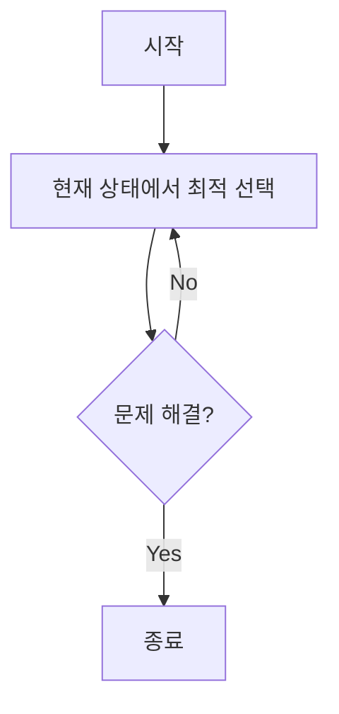

# # 그리디 알고리즘

## 📅 Study Log

**Created:** 2026.02.15

**Last Updated:** 2026.02.16

---

## 🗝️ Key Concept

- **핵심 요약**: 매 순간 당장 가장 좋아 보이는 선택을 하며, 최종적인 해답에 도달하는 알고리즘.
    
- **관련 키워드**: #알고리즘 #그리디 #탐욕법 #Greedy #최적화 #지역최적해 #전역최적해
    
- **사용되는 상황**:
    1. '최적 부분 구조'를 가진 문제.
    2. 현재의 선택이 이후의 선택에 영향을 주지 않을 때.
    3. 문제가 아주 복잡하여 근사해를 구하려 할 때.

---

## 📓 Theory

### 정의

- 매 순간순간마다 **가장 최적이라고 생각되는 것을 선택**해 나가는 방식. 즉, "당장의 이익"을 쫓는 알고리즘. 즉, "당장의 이익"을 쫓는 알고리즘.

### 성질

1. **지역 최적해**: 순간의 최적 선택이 최종 선택이 될 것이라고 가정함. 국소적으로는 최적의 선택이지만, 전체적인 문제 해결의 관점에서는 최적이 아닐 수 있음.
    
2. **효율성**: 모든 경우의 수를 따지지 않으므로 일반적으로 속도가 매우 빠름.
	
3. **불완전성**: 그리디로 해결되는 문제는 흔치 않음. 정당성 증명이 필수적.

### 증명

- **귀납법 (Mathematical Induction)**: 첫 번째 선택이 최적임을 보이고, 이후 선택도 최적임을 단계별로 증명.
    
- **교환 논리 (Exchange Argument)**: 최적해와 그리디 해를 비교하여, 그리디 해의 선택을 바꾸더라도 전체 이득이 늘어나지 않음을 증명.

### 시각 자료



---

## ⌛ Complexity

- 시간 복잡도: 정렬을 사용하는 경우 $O(N \log N)$, 정렬이 필요 없는 경우 $O(N)$.
    
- 공간 복잡도: 정렬을 위한 공간 $O(N)$ 혹은 추가 메모리 없이 $O(1)$.
    
- 추가 메모: 정렬하는 정렬 알고리즘의 복잡도가 그리디의 전체 시간 복잡도를 결정하는 경우가 많음.
    

---

## ⚠️ Caution

1. **최적해 보장 유무**: 당장의 최고 선택이 **최종적인 최고 선택**이 아닐 수 있음을 항상 경계해야 함.
    
2. **정렬 기준**: 올바른 그리디 선택을 위해 데이터를 어떤 기준으로 **정렬**할지가 핵심.
    

---

## ⚙️ Pseudocode

Plaintext

```
함수 브루트포스_탐색(문제 P):
    # 1. 문제에서 발생할 수 있는 '모든 후보'를 하나씩 꺼냄.
    각각의 후보 c를 P의 모든_가능한_선택지들 중에서 반복:
        
        # 2. 지금 꺼낸 후보 c가 정답의 조건에 맞는지 검사.
        만약 조건_확인(c, P)이 참이라면:
            반환 c  # 2-1. 정답을 찾았으므로 즉시 종료 및 결과 전달.
            
    # 3. 모든 후보를 다 확인했는데도 조건을 만족하는 게 없다면,
    반환 실패  # 해가 존재하지 않음
```

---

## 💻 Code snippets

Python

```
# Python: 1부터 N까지 모든 경우를 다 확인하는 형태
def find_answer(n, target):
    for i in range(1, n + 1):
        # 조건에 맞는지 확인
        if i == target:
            return i # 정답 발견
    return -1 # 정답 없음
```

C++

```
// C++: 다중 루프를 통한 조합 탐색
for (int i = 0; i < n; i++) {
    for (int j = i + 1; j < n; j++) {
        for (int k = j + 1; k < n; k++) {
            // 모든 3가지 조합을 다 확인
            int sum = card[i] + card[j] + card[k];
            if (sum <= target) result = max(result, sum);
        }
    }
}
```

---

## ☑️ Baekjoon Problems

- **[1000](1000.cpp)**
    
    - 제목:
	    
    - 활용:
    

---

## 📝 Memo

> Written by **OjOj717**