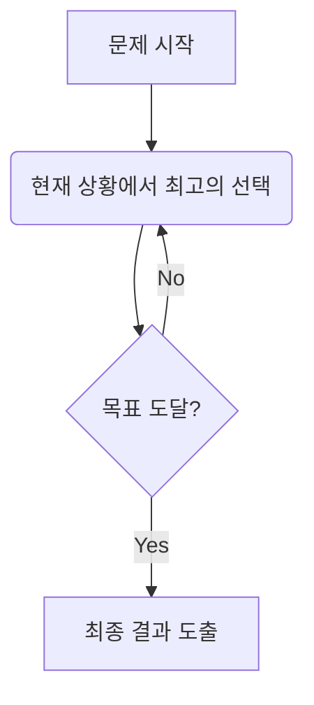

# # 제목

## 📅 Study Log

**Created:** 2026.02.04

**Last Updated:** 2026.02.05

---

## 🗝️ Key Concept

- **핵심 요약**: (짧게)
    
- **관련 키워드**: #알고리즘
    
- **사용되는 상황**:
    1. 

---

## 📓 Theory

### 정의

- 정식 정의 / 개념

### 성질

1. **성질 A**: (설명)
    
2. **성질 B**: (설명)
    

### 증명

증명 과정은 다음과 같습니다: 

f(n)=i=1∑n​i=2n(n+1)​

위 공식에 의해 증명됩니다.

### 시각 자료



---

## ⌛ Complexity

- 시간 복잡도:
    
- 공간 복잡도:
    
- 추가 메모:
    

---

## ⚠️ Caution

1. **주의 A**: (설명)
    
2. **주의 B**: (설명)
    

---

## ⚙️ Pseudocode

Plaintext

```
함수 브루트포스_탐색(문제 P):
    # 1. 문제에서 발생할 수 있는 '모든 후보'를 하나씩 꺼냄.
    각각의 후보 c를 P의 모든_가능한_선택지들 중에서 반복:
        
        # 2. 지금 꺼낸 후보 c가 정답의 조건에 맞는지 검사.
        만약 조건_확인(c, P)이 참이라면:
            반환 c  # 2-1. 정답을 찾았으므로 즉시 종료 및 결과 전달.
            
    # 3. 모든 후보를 다 확인했는데도 조건을 만족하는 게 없다면,
    반환 실패  # 해가 존재하지 않음
```

---

## 💻 Code snippets

Python

```
# Python: 1부터 N까지 모든 경우를 다 확인하는 형태
def find_answer(n, target):
    for i in range(1, n + 1):
        # 조건에 맞는지 확인
        if i == target:
            return i # 정답 발견
    return -1 # 정답 없음
```

C++

```
// C++: 다중 루프를 통한 조합 탐색
for (int i = 0; i < n; i++) {
    for (int j = i + 1; j < n; j++) {
        for (int k = j + 1; k < n; k++) {
            // 모든 3가지 조합을 다 확인
            int sum = card[i] + card[j] + card[k];
            if (sum <= target) result = max(result, sum);
        }
    }
}
```

---

## ☑️ Baekjoon Problems

- **[1000](1000.cpp)**
    
    - 제목:
	    
    - 활용:
    

---

## 📝 Memo

> Written by **OjOj717**